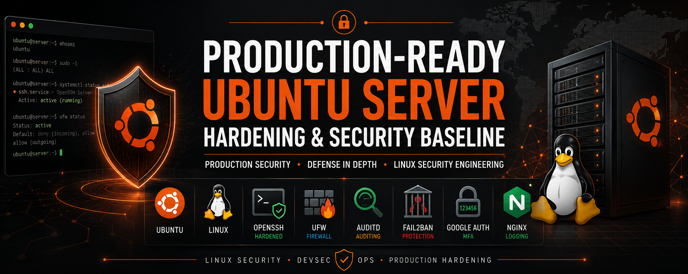
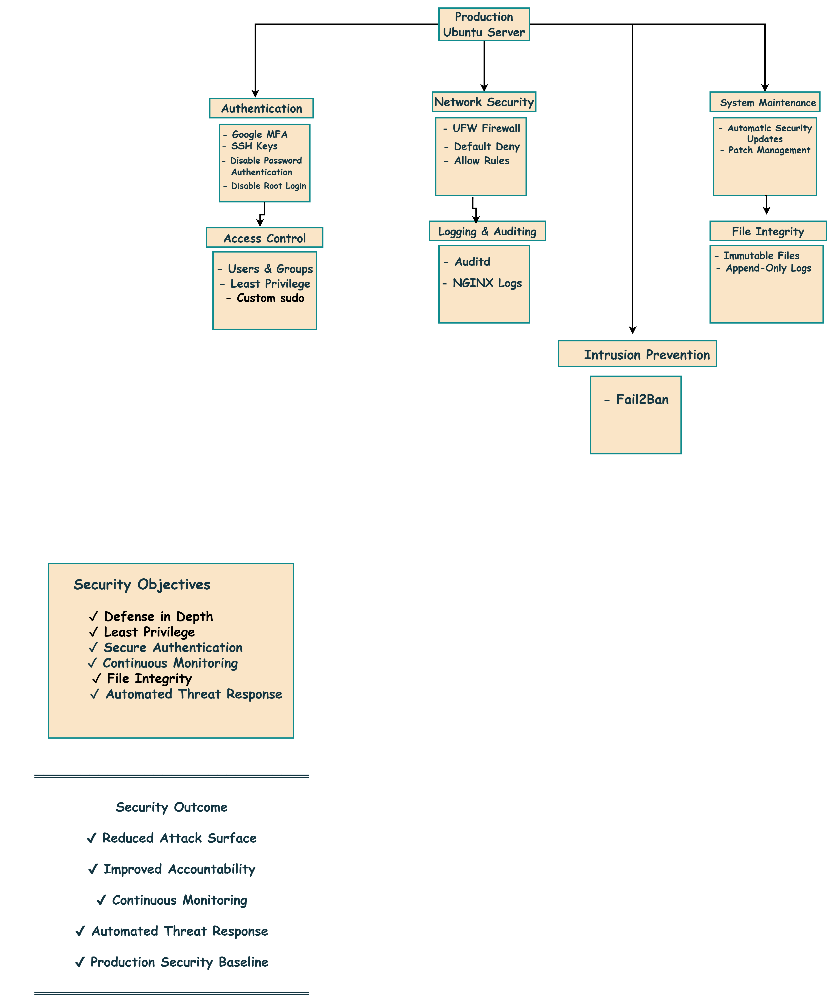

<p align="center">
  
</p>

# 🛡️ Production-Ready Ubuntu Server Hardening & Security Baseline


<p align="center">
  <a href="#-project-overview">Overview</a> •
  <a href="#️-security-architecture">Architecture</a> •
  <a href="#-security-controls-implemented">Controls</a> •
  <a href="#-documentation-guide">Documentation</a> •
  <a href="#️-technology-stack">Technology</a>
</p>

## Project Overview

This project demonstrates the implementation of a **production-oriented Ubuntu Server Hardening & Security Baseline** using layered security controls aligned with industry security best practices.

Rather than simply applying Linux hardening commands, every security control was **implemented, validated, and documented** using real configuration evidence and verification testing. Each chapter of the project demonstrates not only how a security control was configured, but also how its effectiveness was confirmed through practical validation.

The project follows a **Defense-in-Depth** approach, combining secure authentication, access control, logging and auditing, file integrity protection, system maintenance, network security, and intrusion prevention into a single security baseline designed to reduce risk and improve overall system resilience.

The repository serves as both a technical implementation guide and a portfolio project, demonstrating practical Linux security engineering, structured documentation, and production-oriented operational thinking.

## ✨ Project Highlights

- 🛡️ Production-oriented Ubuntu Server hardening
- 🔐 Layered Defense-in-Depth security architecture
- ✅ Real configuration evidence with validation testing
- 📖 Seven structured security domains
- 📸 Configuration screenshots for every implemented control
- 🏗️ Professional security architecture documentation
- 📚 Comprehensive technical documentation

---

## 🏗️ Security Architecture

The security baseline follows a layered **Defense-in-Depth** architecture, where multiple independent security controls work together to reduce risk, strengthen authentication, improve system visibility, and protect the server against common attack techniques.

Rather than relying on a single security mechanism, the architecture combines authentication, access control, monitoring, integrity protection, system maintenance, network security, and intrusion prevention into a unified security model.

<p align="center">
  
</p>

---

## 🔐 Security Controls Implemented

| Security Domain          | Controls Implemented |
|--------------------------|----------------------|
| **Authentication**       | SSH Hardening, SSH Key Authentication, Disable Password Authentication, Google MFA, Disable Root Login |
| **Access Control**       | User & Group Management, Principle of Least Privilege, Custom sudo Policies |
| **Logging & Auditing**   | NGINX Access Logs, Auditd Monitoring, Security Event Auditing |
| **File Integrity**       | Immutable Files, Append-Only Logs |
| **System Maintenance**   | Automatic Security Updates, Patch Management |
| **Network Security**     | UFW Firewall, Default-Deny Firewall Policy, Firewall Validation |
| **Intrusion Prevention** | Fail2Ban SSH Protection |

---

## ✅ Validation Methodology

Every implemented security control was independently validated to confirm that it functioned as intended.

The validation process included:

- Configuration verification
- Functional testing
- Security validation
- Real-world attack simulations where appropriate
- Supporting screenshots captured from the implementation environment

This evidence-based approach demonstrates not only how each control was configured, but also how its effectiveness was verified using practical testing.

---

## 📂 Repository Structure

```text
Production-Ready-Ubuntu-Server-Hardening-Security-Baseline/

├── architecture/
│   ├── ubuntu-server-security-architecture.drawio
│   ├── ubuntu-server-security-architecture.png
│   └── ubuntu-server-security-architecture.svg
│
├── configs/
│
├── docs/
│   ├── 01-authentication.md
│   ├── 02-access-control.md
│   ├── 03-logging-and-auditing.md
│   ├── 04-file-integrity.md
│   ├── 05-system-maintenance.md
│   ├── 06-network-security.md
│   ├── 07-intrusion-prevention.md
│   └── project-summary.md
│
├── screenshots/
│
└── README.md
```

## 📖 Documentation Guide

The complete implementation is documented across seven security domains.

| Document | Description |
|----------|-------------|
| `01-authentication.md` | SSH hardening, SSH keys, MFA, password authentication, root login |
| `02-access-control.md` | User management, groups, least privilege, custom sudo policies |
| `03-logging-and-auditing.md` | NGINX logging, Auditd configuration, security monitoring |
| `04-file-integrity.md` | Immutable files and append-only log protection |
| `05-system-maintenance.md` | Automatic security updates and patch management |
| `06-network-security.md` | UFW firewall configuration and validation |
| `07-intrusion-prevention.md` | Fail2Ban configuration and brute-force protection |
| `project-summary.md` | Complete project overview and engineering summary |

---

## 🛠️ Technology Stack

| Category                  | Technology                                  |
| ------------------------- | ------------------------------------------- |
| **Operating System**      | Ubuntu Server                               |
| **Remote Access**         | OpenSSH                                     |
| **Authentication**        | SSH Keys, Google PAM MFA                    |
| **Access Control**        | Linux Users, Groups, sudo                   |
| **Logging & Auditing**    | NGINX Access Logs, Auditd                   |
| **File Integrity**        | chattr (Immutable & Append-Only Attributes) |
| **Firewall**              | UFW (Uncomplicated Firewall)                |
| **Intrusion Prevention**  | Fail2Ban                                    |
| **Package Management**    | APT                                         |
| **Documentation**         | Markdown                                    |
| **Architecture Diagrams** | Draw.io                                     |

---

## 🛡️ Security Principles

The security baseline was designed around established security engineering principles that work together to improve the overall resilience of the server.

* **Defense in Depth** - Multiple independent security controls reduce the likelihood of a single point of failure.

* **Principle of Least Privilege** - Administrative permissions are limited to only what is necessary to perform required tasks.

* **Secure Authentication** - SSH keys, Multi-Factor Authentication, and root login restrictions strengthen administrative access.

* **Continuous Monitoring** - Auditd and system logging provide visibility into security-relevant events.

* **Default-Deny Security** - Firewall policies explicitly permit only authorized network traffic.

* **Evidence-Based Validation** - Every implemented security control was verified through practical testing and documented using supporting evidence.

---

## 🚀 Future Improvements

Potential enhancements that could further strengthen this security baseline include:

* Centralized log aggregation using a SIEM platform
* File Integrity Monitoring (AIDE)
* Endpoint Detection and Response (EDR)
* Automated vulnerability scanning
* CIS Benchmark compliance assessment
* Security compliance automation with OpenSCAP
* Infrastructure as Code using Terraform and Ansible
* Cloud-native monitoring and alerting with AWS security services

These additions would further improve automation, visibility, compliance, and operational scalability within production environments.

---

## 🙏 Acknowledgements

This project was developed as part of a continuous hands-on learning journey in Linux Security, Cloud Engineering, and DevSecOps.

Every security control was implemented, tested, validated, and documented with the goal of developing practical engineering experience while following production-oriented security practices.

The repository reflects an emphasis on understanding not only **how** security controls are implemented, but also **why** they matter and **how** their effectiveness can be verified through structured testing and documentation.

---

## ⭐ Final Remarks

Security is not achieved through a single configuration or security tool.

It is the result of implementing multiple complementary controls that work together to reduce risk, improve visibility, strengthen accountability, and increase resilience against evolving threats.

This repository represents a practical implementation of a production-ready Ubuntu Server hardening baseline, combining technical implementation, validation testing, architecture design, and structured documentation into a single engineering project.
