# Authentication Hardening

## Overview

Authentication is the first line of defense for any Linux server. Weak authentication mechanisms increase the risk of unauthorized access through brute-force password attacks, credential theft, compromised privileged accounts, and automated scanning.

This document outlines the authentication hardening measures implemented on an Ubuntu server to strengthen remote access, reduce the attack surface, and align the server with common security best practices used in production environments.

### Authentication Security Controls

### The following authentication security controls were implemented to strengthen remote administrative access, reduce the server's attack surface, and align the server with production security best practices.

- Reduce the SSH attack surface by limiting unnecessary exposure.
- Eliminate password-based authentication for remote access.
- Enforce secure SSH key-based authentication.
- Prevent direct root login over SSH.
- Introduce Multi-Factor Authentication (MFA) to strengthen privileged authentication.
  
## Threat Model

By default, SSH is commonly exposed on TCP port 22 and often relies on password-based authentication. These defaults make Linux servers frequent targets for automated reconnaissance, brute-force attacks, and credential stuffing attempts.

If an attacker successfully compromises a privileged account, they may gain unauthorized access to sensitive data, modify system configurations, install malicious software, or disrupt critical services.

The authentication hardening measures implemented in this project are designed to reduce these risks by strengthening user authentication and limiting opportunities for unauthorized access.

## Lab Environment

The authentication hardening activities documented in this project were performed within a controlled Ubuntu Server virtual machine to simulate a production-like Linux environment while allowing security configurations to be safely tested and validated.

### Environment Details

 Component       | Details 
---------------- | ---------  
Operating System | Ubuntu Server 
Virtualization   | Hyper-V (Type 2 Hypervisor) 
SSH Client       | MobaXterm 
Authentication   | SSH Keys (ED25519) 
MFA              | Google Authenticator (PAM) 
Test Environment | Local Virtual Lab 

## Authentication Controls Implemented

# 1. Changing the Default SSH Port

### Why?

By default, SSH listens on TCP port **22**, a well-known port that is constantly targeted by automated internet scanners and brute-force attacks.

Although changing the default SSH port does **not** prevent a determined attacker from discovering the service, it significantly reduces noise generated by automated bots that continuously probe port 22 across the internet.

This security measure helps reduce unnecessary authentication attempts and keeps server logs cleaner, allowing administrators to focus on more meaningful security events.

### Implementation

The SSH daemon configuration file was updated by modifying the listening port within the `/etc/ssh/sshd_config` configuration file.

The default SSH port (22) was changed to a custom port to reduce exposure to automated scanning activity.

After updating the configuration, the SSH service was restarted for the changes to take effect.

### Configuration

**Before**

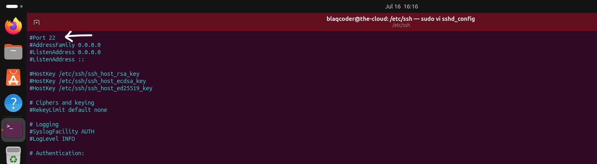

The SSH daemon was initially configured to listen on the default TCP port (22).

---

**After**

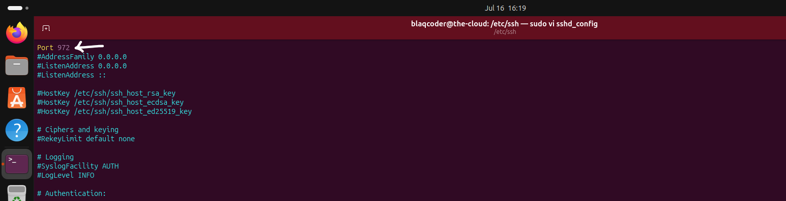

The SSH daemon was successfully reconfigured to listen on the custom SSH port (972) instead of the default port 22.

### Verification

The SSH configuration was validated to confirm that the server no longer accepted connections on the default SSH port (22) and successfully accepted authenticated connections on the newly configured custom SSH port.

---

### Test Setup

The SSH client (MobaXterm) was configured to connect to the server using the default SSH port (22).

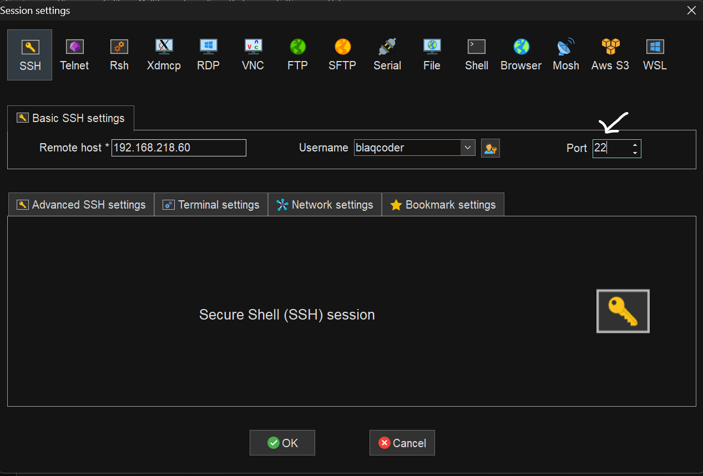

### Verification Result

The connection attempt failed as expected because the SSH daemon was no longer listening on the default SSH port.

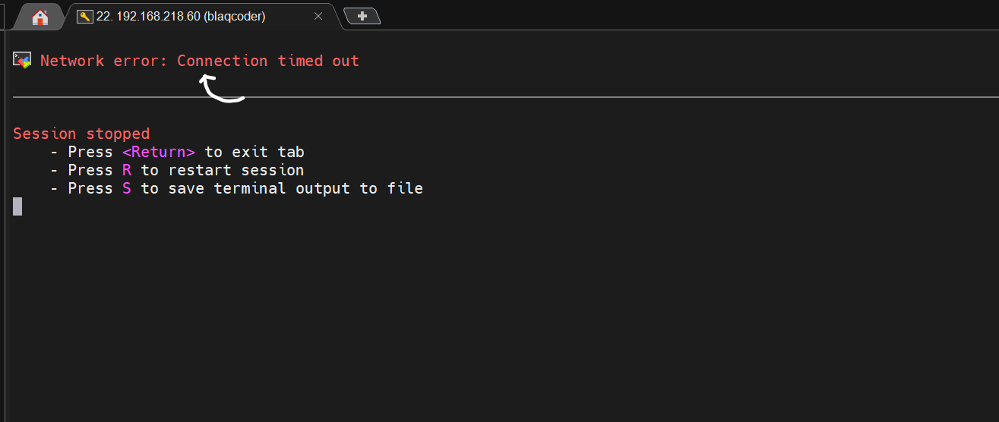

---

### Test 2 - Connection Attempt Using the Custom SSH Port (972)

### Test Setup

The SSH client (MobaXterm) was configured to initiate a connection using the newly configured custom SSH port (972).

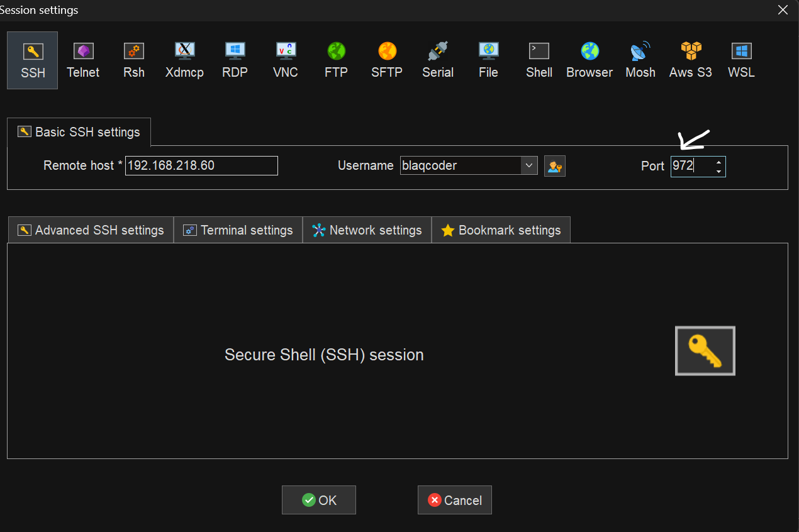

### Verification Result

The SSH connection was successfully established using the configured custom SSH port, confirming that the SSH daemon was operating correctly after the configuration change.

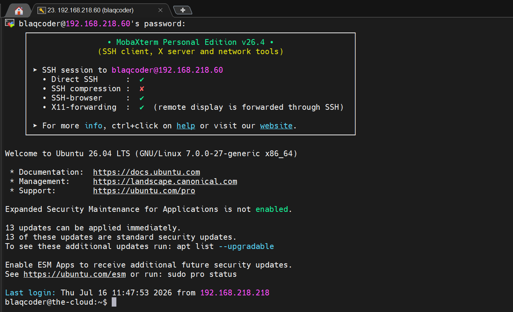

### Security Impact

Changing the default SSH port reduced exposure to automated scanning and brute-force attempts commonly directed at TCP port 22. While this measure does not provide complete protection against targeted attacks, it contributes to reducing unnecessary authentication noise and complements stronger controls such as SSH key authentication, MFA, and least-privilege access.


# 2. Configure SSH Key Authentication

### Why?

Password-based authentication is vulnerable to brute-force attacks, password spraying, and credential theft. Even when strong password policies are enforced, passwords remain susceptible to phishing attacks, password reuse, and accidental disclosure.

SSH key-based authentication provides a significantly stronger authentication mechanism by replacing passwords with a cryptographic key pair consisting of a private key and a public key. Authentication succeeds only when the client possesses the corresponding private key, making unauthorized access substantially more difficult.

For this reason, SSH key authentication is considered an industry best practice and is widely adopted across production Linux environments.

### Implementation

An ED25519 SSH key pair was generated on the client machine using the `ssh-keygen` utility.

The generated public key was copied to the target user's `~/.ssh/authorized_keys` file on the Ubuntu server, while the private key remained securely stored on the client machine.

This configuration allows the SSH server to verify the client's identity using asymmetric cryptography without transmitting or storing user passwords during authentication.

## Configuration

### Generating the SSH Key Pair

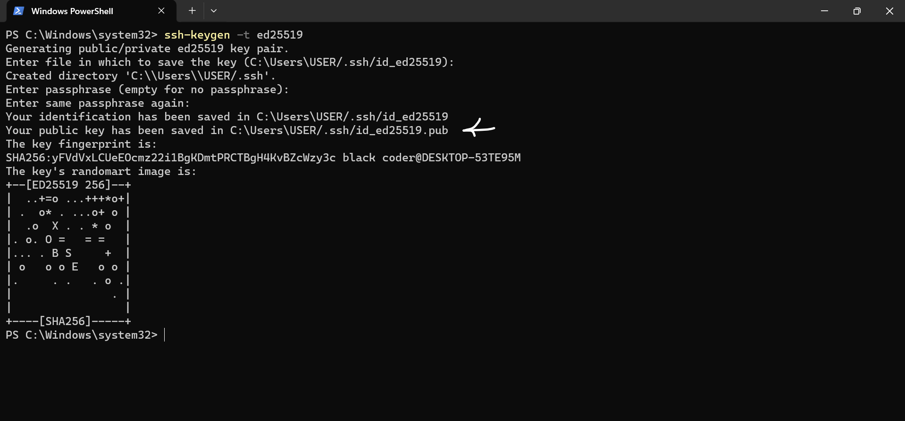

An ED25519 SSH key pair was generated on the client machine using the `ssh-keygen` utility.

---

### Public Key Installed on the Server

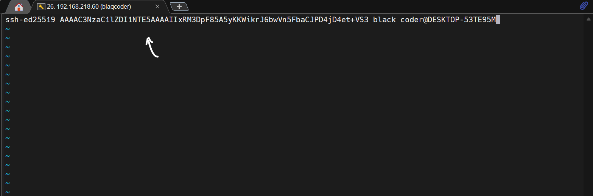

The generated public key was added to the target user's `~/.ssh/authorized_keys` file to enable key-based authentication.

### Verification

The SSH key authentication configuration was validated by attempting to establish a remote SSH session using the generated private key.

---

## Test 1 - SSH Authentication Using the Private Key

### Expected Result

The SSH connection should be successfully established without requesting a password, demonstrating that the server recognizes the corresponding public key stored in the user's `authorized_keys` file.

### Test Setup

The SSH client (MobaXterm) was configured to authenticate using the generated ED25519 private key.

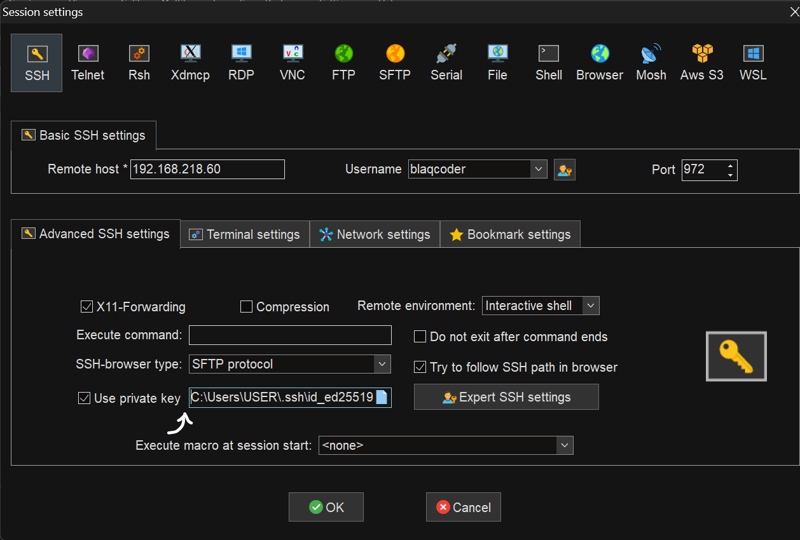

### Verification Result

The SSH session was successfully established using key-based authentication without requiring a user password.

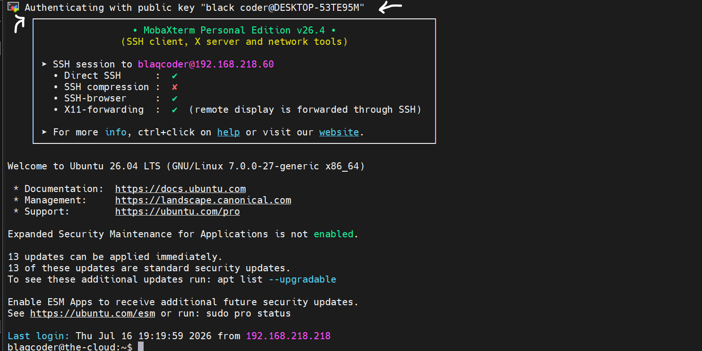

### Security Validation 

The successful authentication confirms that the server correctly validated the client's public-private key pair and accepted the connection using cryptographic authentication instead of password-based authentication.

> 💡 **Production Note**
>
> The private SSH key should never be copied to the server or shared with other users. Only the public key should be distributed to target systems. If a private key is compromised, it should be revoked immediately and replaced with a newly generated key pair.


# 3. Disable Password Authentication

### Why?

Password-based authentication remains one of the most commonly targeted attack vectors against Linux servers. Even when strong password policies are enforced, passwords are still vulnerable to brute-force attacks, password spraying, phishing, credential reuse, and accidental disclosure.

After successfully implementing SSH key-based authentication, password authentication became unnecessary for administrative access. Disabling password authentication significantly reduces the server's attack surface by ensuring that users can authenticate only through cryptographic key pairs.

This layered approach aligns with security best practices for production Linux environments by eliminating password-based authentication while maintaining secure administrative access through SSH keys.

### Implementation

The SSH daemon configuration was updated by modifying the `PasswordAuthentication` directive within the `/etc/ssh/sshd_config` configuration file.

The value was changed from its default configuration to:

```text
PasswordAuthentication no
```

After saving the configuration, the SSH service was restarted to apply the changes.

From this point onward, the SSH daemon no longer accepted password-based authentication requests, requiring users to authenticate exclusively using their registered SSH key pairs.

### Configuration

### Password Authentication Disabled

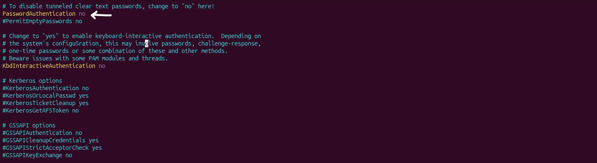

The `PasswordAuthentication` directive was configured with the value `no`, preventing the SSH daemon from accepting password-based authentication requests.

## Verification

The SSH authentication configuration was validated to confirm that password-based authentication was no longer accepted while SSH key-based authentication continued to function as expected.

---

### Test 1 - Password-Based SSH Authentication

### Test Setup

The SSH client (MobaXterm) was configured to authenticate using a username and password.


### Verification Result

The SSH server rejected the authentication request because password-based authentication had been disabled.

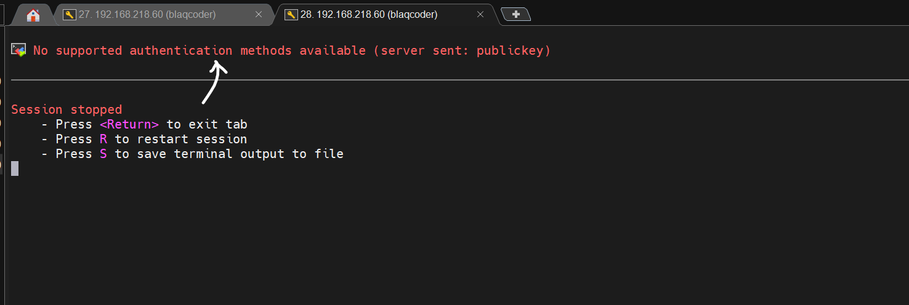

### Security Validation

The failed authentication confirms that the SSH daemon no longer accepts password-based authentication requests, significantly reducing the risk of brute-force attacks and credential-based compromises.

---

### Test 2 - SSH Key-Based Authentication

### Test Setup

The SSH client (MobaXterm) was configured to authenticate using the previously generated ED25519 private key.

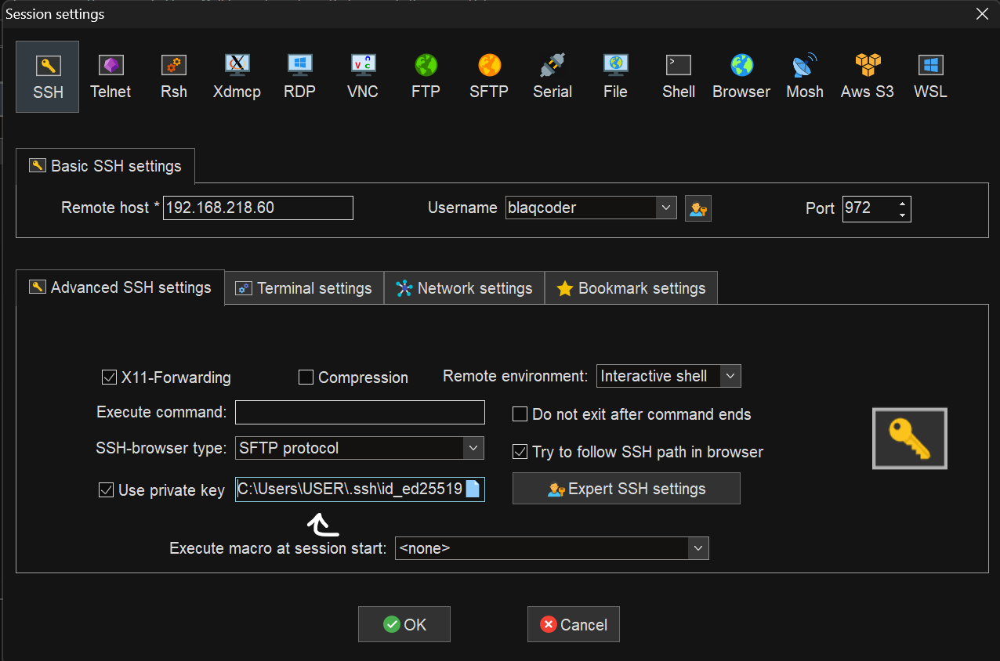

### Verification Result

The SSH session was successfully established using SSH key authentication without prompting for a password.

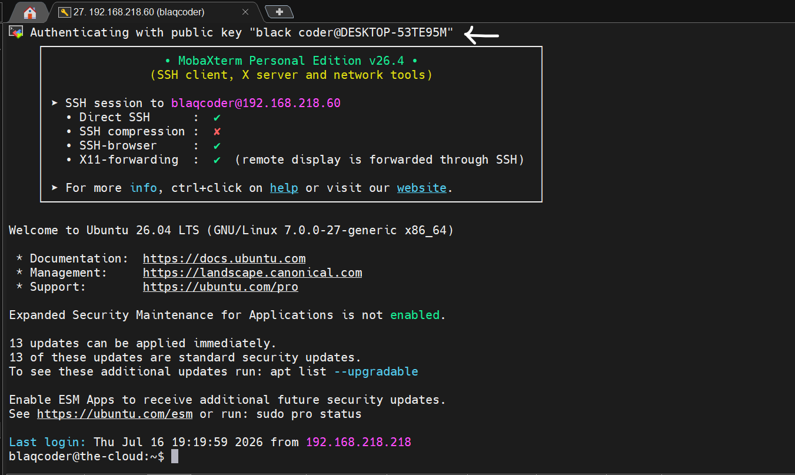

### Security Validation

The successful authentication confirms that administrative access remains available through SSH key-based authentication while password-based authentication has been completely disabled.

> 💡 **Production Note**
>
> Before disabling password authentication on a production server, verify that at least one administrator can successfully authenticate using SSH keys. Disabling password authentication without validating SSH key access can permanently lock administrators out of the system.


# 4. Multi-Factor Authentication (MFA)

### Why?

Authentication should not rely solely on a single factor, even when SSH key-based authentication is enforced. In production environments, privileged operations performed with `sudo` can significantly impact system security. Requiring an additional verification factor helps reduce the risk of unauthorized privileged access if an authenticated session is left unattended or a trusted device is temporarily compromised.

To strengthen privileged authentication, Google PAM was integrated with the Linux Pluggable Authentication Modules (PAM) framework, requiring administrators to provide a time-based one-time password (TOTP) before executing privileged commands with `sudo`.

### Implementation

Google Authenticator PAM was installed and integrated with the Linux PAM authentication framework.

The PAM configuration for `sudo` was updated to require successful Multi-Factor Authentication (MFA) before granting elevated privileges.

Each administrator configured their own TOTP secret using the Google Authenticator setup process and enrolled the generated QR code in an authenticator application.

After configuration, every privileged command executed with `sudo` required a valid time-based verification code in addition to the user's existing authentication.

## Configuration

### Google Authenticator Configuration

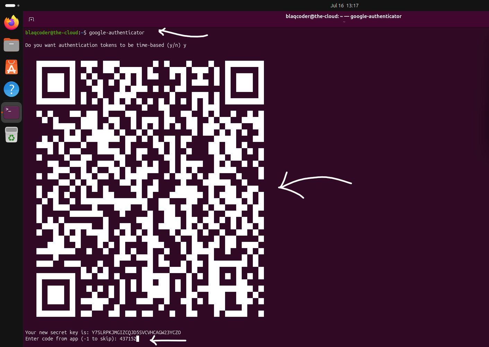

Google Authenticator was initialized for the administrative account, generating a unique TOTP secret used for Multi-Factor Authentication.

---

### PAM Configuration

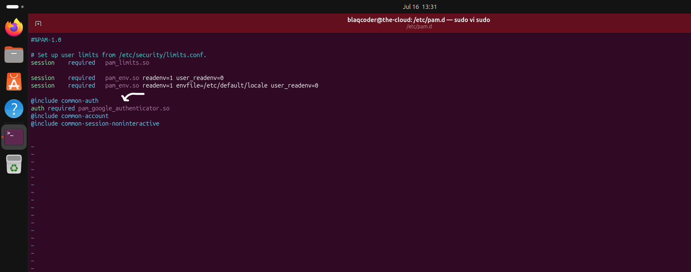

The PAM configuration for `sudo` was updated to require a valid TOTP verification code before granting elevated privileges.

#### Verification

The MFA configuration was validated by executing privileged commands using `sudo` to confirm that elevated access required successful Multi-Factor Authentication.

---

## Test 1  Invalid Verification Code

### Verification Result

A privileged command was executed using `sudo`, and an incorrect TOTP verification code was entered when prompted. The authentication request was rejected, preventing the command from executing.

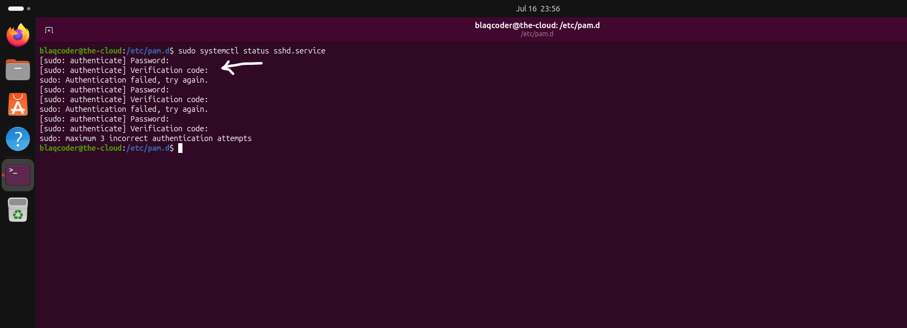

### Security Validation

The failed authentication confirms that privileged operations cannot proceed without a valid Multi-Factor Authentication verification code.

---

## Test 2 - Valid Verification Code

### Verification Result

The same privileged command was executed using `sudo`, this time with the correct TOTP verification code generated by the authenticator application. Authentication succeeded, allowing the command to execute successfully.

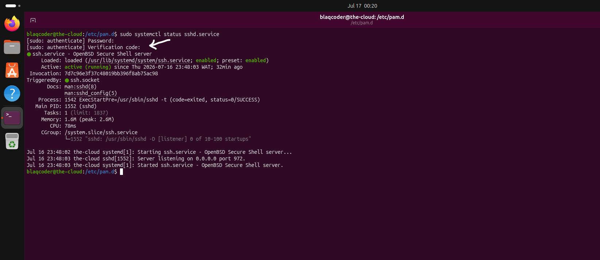

### Security Validation

Successful authentication confirms that privileged operations require a valid second authentication factor before granting elevated access.

# 5. Disable Direct Root Login

### Why?

The root account possesses unrestricted privileges across the operating system, making it one of the most valuable targets for attackers. Allowing direct SSH access to the root account increases the potential impact of credential compromise while eliminating accountability, since administrative actions cannot be attributed to individual users.

Production environments typically require administrators to authenticate using their individual user accounts before elevating privileges with `sudo`. This approach strengthens accountability, improves auditability, and reduces the risk associated with privileged account misuse.

To align the server with this security practice, direct SSH login for the root account was disabled.

## Implementation

The SSH daemon configuration was updated by modifying the `PermitRootLogin` directive within the `/etc/ssh/sshd_config` configuration file.

The value was configured as:

```text
PermitRootLogin no
```

After saving the configuration, the SSH service was restarted to apply the changes.

From this point onward, remote SSH authentication to the root account was no longer permitted. Administrative access now requires users to authenticate with their individual accounts before elevating privileges using `sudo`.

## Configuration

### Root Login Disabled

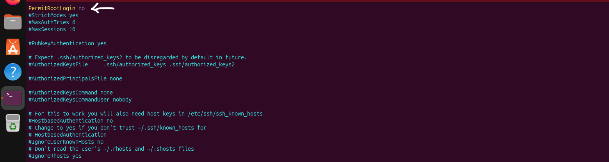

The `PermitRootLogin` directive was configured with the value `no`, preventing direct SSH authentication to the root account.

### Verification

The SSH configuration was validated by attempting to authenticate directly as the root user.

---

### Test 1  Direct Root Login Attempt

### Expected Result

The SSH server should reject all direct authentication attempts to the root account.

### Verification Result

An SSH connection was initiated using the root account. The authentication request was rejected, confirming that direct root login had been successfully disabled.

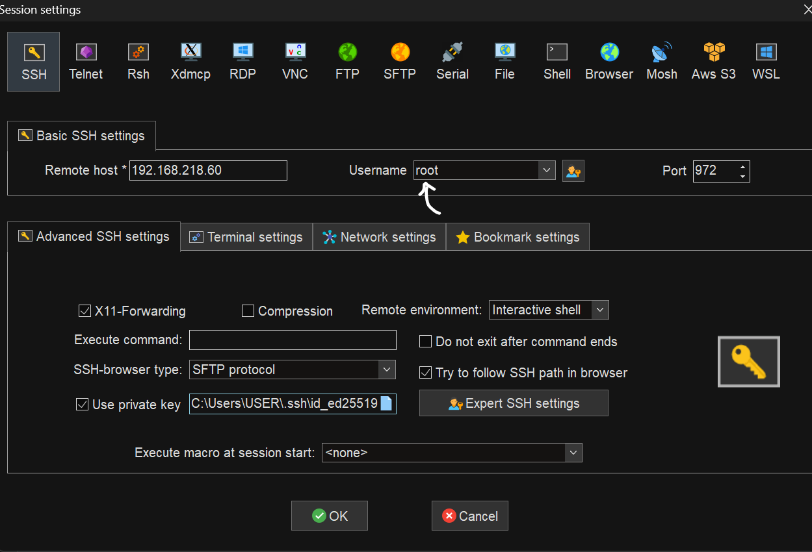

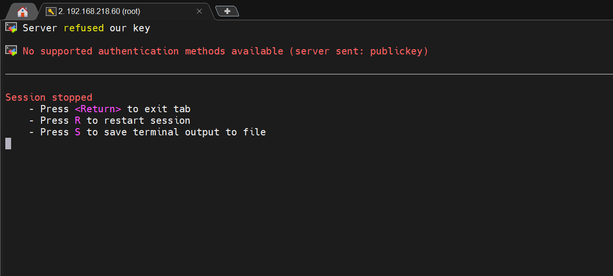

### Security Validation

The failed authentication confirms that administrators can no longer establish remote SSH sessions directly as the root user, reducing the risk of privileged account compromise and improving accountability.

> 💡 **Production Note**
>
> Disabling direct root login does not remove administrative capabilities. Instead, administrators authenticate using individual accounts and elevate privileges with `sudo`, providing stronger accountability, improved audit trails, and reduced exposure of the root account.


# Access Control

Once users have been successfully authenticated, the next step is to determine what resources and administrative capabilities they are permitted to access.

Authentication verifies identity, while authorization defines permissions. Applying the Principle of Least Privilege (PoLP) ensures that users receive only the minimum level of access required to perform their responsibilities, reducing the potential impact of accidental misuse, insider threats, and compromised accounts.

This chapter demonstrates how access controls were implemented to restrict administrative privileges, improve accountability, and align the server with production security best practices.

## Access Control Security Controls

The following access control security measures were implemented to enforce the Principle of Least Privilege and strengthen administrative governance.

- Create dedicated users and security groups.
- Apply the Principle of Least Privilege (PoLP).
- Configure granular `sudo` policies for administrative tasks.

# 1. Users and Groups

### Why?

Administrative access should never be shared through a single account. Assigning individual user accounts improves accountability by allowing administrative actions to be traced back to specific users. Organizing users into groups further simplifies permission management by allowing access rights to be assigned collectively rather than individually.

This approach reduces administrative overhead while supporting scalable and maintainable access control in production environments.

## Implementation

Dedicated user accounts were created to represent individual administrators rather than relying on shared credentials.

Administrative groups were then created to logically organize users with similar responsibilities. Users requiring the same level of access were assigned to the appropriate group, simplifying permission management and preparing the server for role-based administrative access.

## Configuration

The access control configuration was implemented by creating dedicated administrative users and organizing them into security groups to support role-based permission management.

---

### Administrative User Configuration

A dedicated administrative user account was created and immediately verified to confirm that the account was successfully provisioned on the server.


---

### Administrative Group Configuration

A security group was created, and the administrative user was assigned to the group. The group membership was then verified to confirm that the access control configuration had been successfully applied.

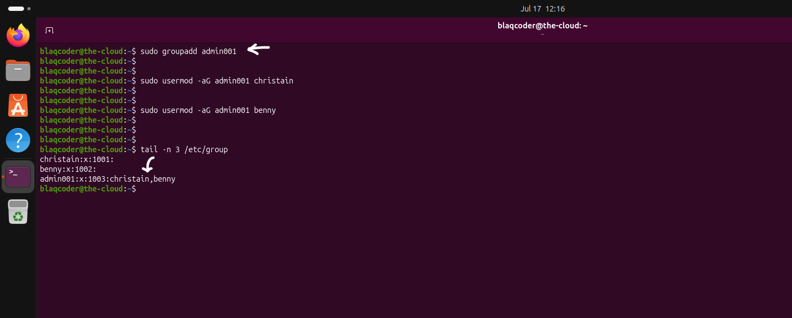

### Security Validation

Managing permissions through groups simplifies access administration and supports scalable implementation of the Principle of Least Privilege.

> 💡 **Production Note**
>
> Managing permissions through groups instead of assigning privileges directly to individual users improves scalability and simplifies administrative management. As teams grow, access can be adjusted by modifying group membership rather than updating permissions for each user individually.

# 2. Principle of Least Privilege (PoLP)

### Why?

Granting users unrestricted administrative privileges significantly increases the potential impact of accidental mistakes, insider threats, and compromised accounts. The Principle of Least Privilege (PoLP) reduces this risk by ensuring that users receive only the minimum permissions required to perform their assigned responsibilities.

Restricting administrative capabilities in this manner strengthens the server's security posture, improves accountability, and reduces the attack surface associated with privileged access.

## Implementation

Administrative access was designed around the Principle of Least Privilege by assigning permissions according to operational responsibilities rather than granting unrestricted administrative access.

Instead of providing full system-wide privileges, access was intentionally restricted so that users could perform only the administrative tasks required for their roles. More granular permission assignments are implemented in the following section using custom `sudo` policies.

## Access Control Design

The server's access model was intentionally designed to avoid granting unrestricted administrative privileges to every user.

Permissions were planned according to operational responsibilities, ensuring that elevated access would be granted only where required. This design establishes a scalable authorization model that supports secure administration while minimizing unnecessary privilege exposure.

## Security Validation

Applying the Principle of Least Privilege reduces the likelihood of unauthorized or accidental administrative actions by limiting access to only those privileges required for each role.

This approach also improves accountability by ensuring that administrative permissions are intentionally assigned rather than broadly distributed across all users.

> 💡 **Production Note**
>
> The Principle of Least Privilege is a foundational security concept adopted across enterprise environments. Rather than assigning broad administrative permissions by default, organizations typically grant users only the minimum level of access required for their responsibilities and expand privileges only when operationally necessary.


