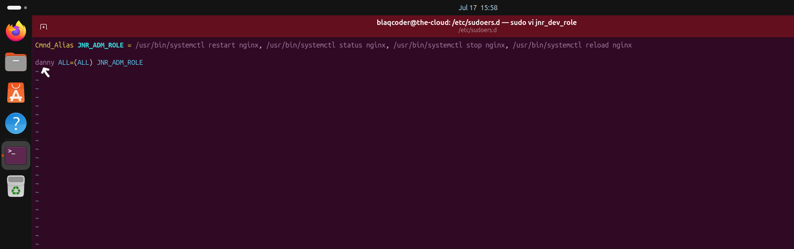
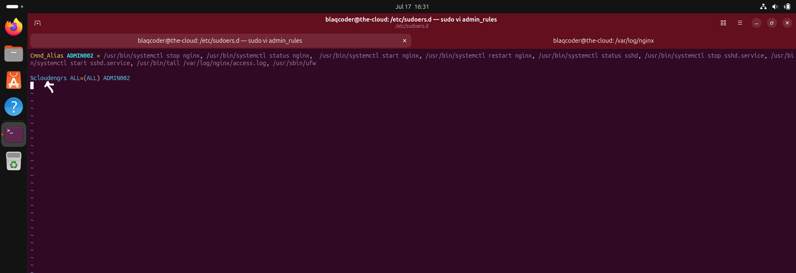
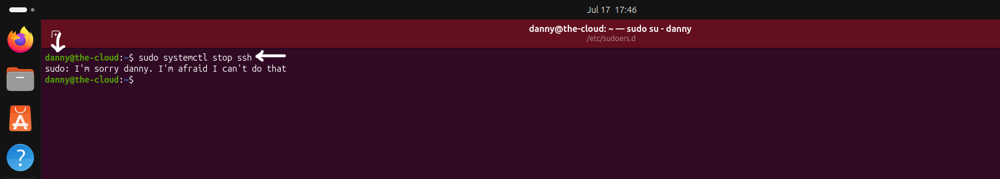
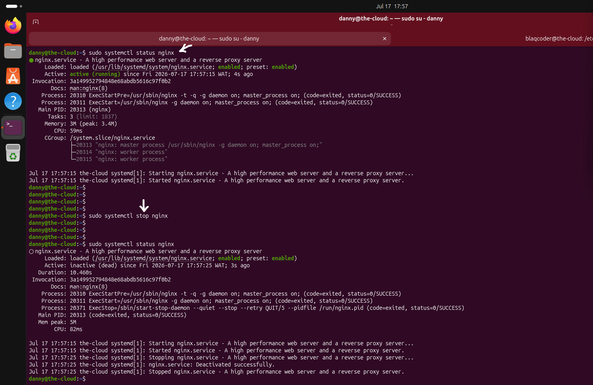

# Access Control

Once users have been successfully authenticated, the next step is to determine what resources and administrative capabilities they are permitted to access.

Authentication verifies identity, while authorization defines permissions. Applying the Principle of Least Privilege (PoLP) ensures that users receive only the minimum level of access required to perform their responsibilities, reducing the potential impact of accidental misuse, insider threats, and compromised accounts.

This chapter demonstrates how access controls were implemented to restrict administrative privileges, improve accountability, and align the server with production security best practices.

## Access Control Security Controls

The following access control security measures were implemented to enforce the Principle of Least Privilege and strengthen administrative governance.

- Create dedicated users and security groups.
- Apply the Principle of Least Privilege (PoLP).
- Configure granular `sudo` policies for administrative tasks.

# 1. Users and Groups

### Why?

Administrative access should never be shared through a single account. Assigning individual user accounts improves accountability by allowing administrative actions to be traced back to specific users. Organizing users into groups further simplifies permission management by allowing access rights to be assigned collectively rather than individually.

This approach reduces administrative overhead while supporting scalable and maintainable access control in production environments.

## Implementation

Dedicated user accounts were created to represent individual administrators rather than relying on shared credentials.

Administrative groups were then created to logically organize users with similar responsibilities. Users requiring the same level of access were assigned to the appropriate group, simplifying permission management and preparing the server for role-based administrative access.

## Configuration

The access control configuration was implemented by creating dedicated administrative users and organizing them into security groups to support role-based permission management.

---

### Administrative User Configuration

A dedicated administrative user account was created and immediately verified to confirm that the account was successfully provisioned on the server.

---

### Administrative Group Configuration

A security group was created, and the administrative user was assigned to the group. The group membership was then verified to confirm that the access control configuration had been successfully applied.

### Security Validation

Managing permissions through groups simplifies access administration and supports scalable implementation of the Principle of Least Privilege.

> 💡 **Production Note**
>
> Managing permissions through groups instead of assigning privileges directly to individual users improves scalability and simplifies administrative management. As teams grow, access can be adjusted by modifying group membership rather than updating permissions for each user individually.

# 2. Principle of Least Privilege (PoLP)

### Why?

Granting users unrestricted administrative privileges significantly increases the potential impact of accidental mistakes, insider threats, and compromised accounts. The Principle of Least Privilege (PoLP) reduces this risk by ensuring that users receive only the minimum permissions required to perform their assigned responsibilities.

Restricting administrative capabilities in this manner strengthens the server's security posture, improves accountability, and reduces the attack surface associated with privileged access.

## Implementation

Administrative access was designed around the Principle of Least Privilege by assigning permissions according to operational responsibilities rather than granting unrestricted administrative access.

Instead of providing full system-wide privileges, access was intentionally restricted so that users could perform only the administrative tasks required for their roles. More granular permission assignments are implemented in the following section using custom `sudo` policies.

## Access Control Design

The server's access model was intentionally designed to avoid granting unrestricted administrative privileges to every user.

Permissions were planned according to operational responsibilities, ensuring that elevated access would be granted only where required. This design establishes a scalable authorization model that supports secure administration while minimizing unnecessary privilege exposure.

## Security Validation

Applying the Principle of Least Privilege reduces the likelihood of unauthorized or accidental administrative actions by limiting access to only those privileges required for each role.

This approach also improves accountability by ensuring that administrative permissions are intentionally assigned rather than broadly distributed across all users.

> 💡 **Production Note**
>
> The Principle of Least Privilege is a foundational security concept adopted across enterprise environments. Rather than assigning broad administrative permissions by default, organizations typically grant users only the minimum level of access required for their responsibilities and expand privileges only when operationally necessary.

# 3. Custom `sudo` Policies

### Why?

Granting unrestricted administrative privileges to every user increases the risk of accidental system changes, privilege misuse, and unauthorized administrative actions. A more secure approach is to grant users access only to the administrative commands required for their responsibilities.

Custom `sudo` policies provide granular authorization by allowing administrators to define exactly which commands a user or group can execute with elevated privileges, without providing unrestricted root access.

## Implementation

Custom `sudo` policies were implemented using the `/etc/sudoers.d/` directory.

Separate policy files were created to define administrative permissions for both individual users and security groups. Each policy explicitly listed the commands that could be executed with elevated privileges, ensuring administrative access remained limited to approved operational tasks.

## Configuration

### User-Specific `sudo` Policy

A custom `sudo` policy was created for an individual user, allowing access only to explicitly authorized administrative commands.

---

### Group-Based `sudo` Policy

A separate `sudo` policy was created for an administrative group. Users assigned to the group automatically inherited the permissions defined within the policy.

### Verification

The configured `sudo` policies were validated by attempting both authorized and unauthorized administrative operations.

---

### Test 1 - Unauthorized Administrative Command

### Verification Result

An attempt to execute an unauthorized administrative command was rejected by the system.

### Security Validation 

The denied operation confirms that administrative privileges were successfully restricted according to the Principle of Least Privilege.

---

### Test 2 - Authorized Administrative Command

### Verification Result

The authorized command executed successfully, confirming that the custom `sudo` policy granted the intended administrative permission.

### Security Validation

Successful execution confirms that administrative permissions were granted only for explicitly authorized operations.

> 💡 **Production Note**
>
> Enterprise environments commonly assign administrative permissions through role-based `sudo` policies rather than granting unrestricted root or full `sudo` access. This approach simplifies permission management, improves accountability, and reduces the impact of compromised accounts by limiting administrative capabilities to approved operational tasks.

