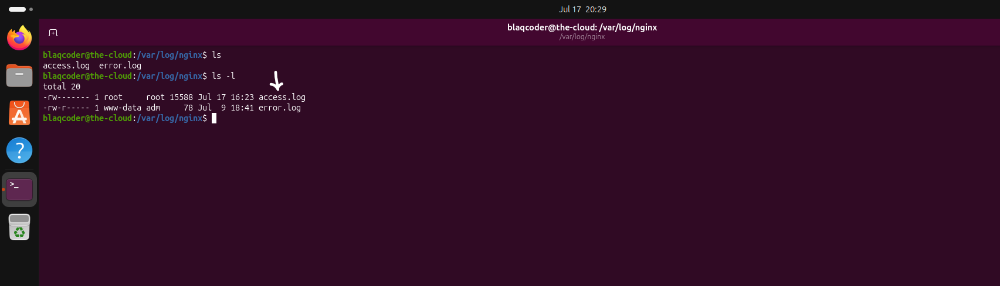

# Logging & Auditing

## Overview

Protecting a system extends beyond controlling who can authenticate and what actions they are permitted to perform. It also requires maintaining reliable records of system activity to support operational visibility, security monitoring, incident response, and forensic investigations.

Logs provide evidence of events occurring on a system, while auditing records the actions performed by users and processes. Together, these controls improve accountability, simplify troubleshooting, and enable organizations to detect unauthorized or suspicious activity.

This chapter demonstrates how logging and auditing were implemented to improve system visibility and strengthen the server's security posture.

## Logging & Auditing Security Controls

The following logging and auditing controls were implemented to improve system visibility, support security monitoring, and strengthen accountability.

- Monitoring web server activity through NGINX access logs.
- Auditing access to sensitive files using Linux Auditd.
- Protecting critical log files from unauthorized modification.

# 1. NGINX Access Logs

### Why?

Web server logs provide a detailed record of incoming client requests, making them an essential source of operational and security information. They allow administrators to monitor website activity, troubleshoot issues, identify abnormal traffic patterns, and support incident investigations.

Collecting web server logs also improves visibility into client IP addresses, requested resources, HTTP response codes, user agents, and request timestamps, all of which contribute to effective security monitoring.

### Implementation

NGINX was installed and configured as the web server for the Ubuntu system. Client requests were then monitored by observing the NGINX access log located at:

```text
/var/log/nginx/access.log
```

***

## Configuration

### Real-Time NGINX Access Log Monitoring

The NGINX access log was monitored in real time while requests were made to the hosted website.


