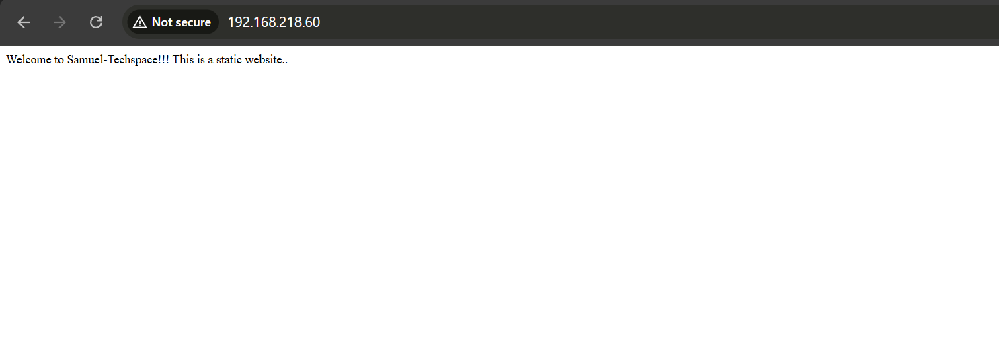
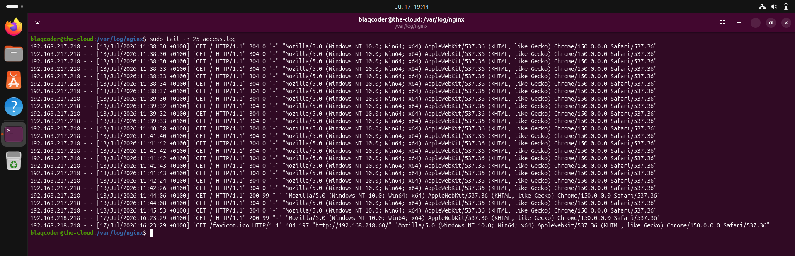
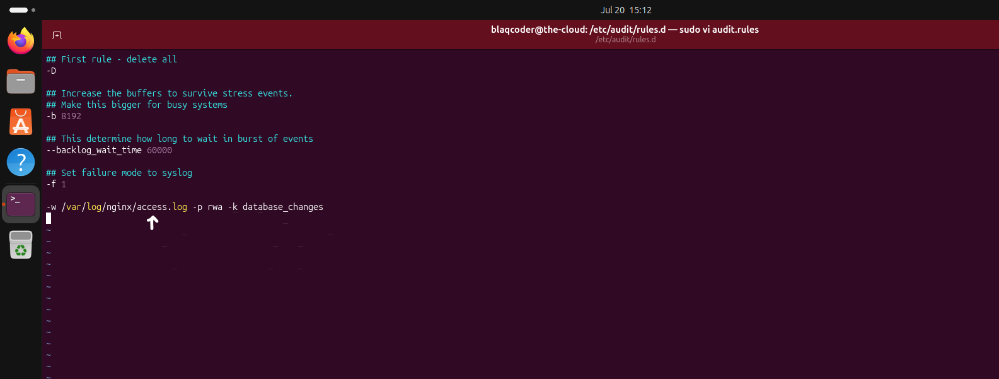
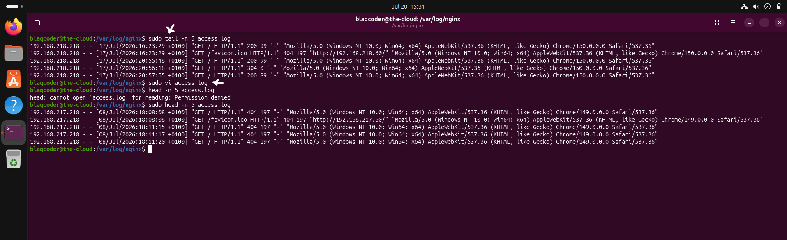
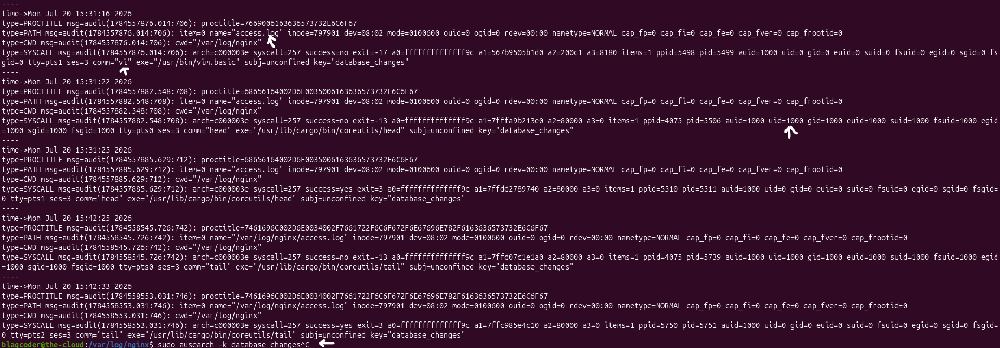

# Logging & Auditing

## Overview

Protecting a system extends beyond controlling who can authenticate and what actions they are permitted to perform. It also requires maintaining reliable records of system activity to support operational visibility, security monitoring, incident response, and forensic investigations.

Logs provide evidence of events occurring on a system, while auditing records the actions performed by users and processes. Together, these controls improve accountability, simplify troubleshooting, and enable organizations to detect unauthorized or suspicious activity.

This chapter demonstrates how logging and auditing were implemented to improve system visibility and strengthen the server's security posture.

## Logging & Auditing Security Controls

The following logging and auditing controls were implemented to improve system visibility, support security monitoring, and strengthen accountability.

- Monitoring web server activity through NGINX access logs.
- Auditing access to sensitive files using Linux Auditd.
- Protecting critical log files from unauthorized modification.

# 1. NGINX Access Logs

### Why?

Web server logs provide a detailed record of incoming client requests, making them an essential source of operational and security information. They allow administrators to monitor website activity, troubleshoot issues, identify abnormal traffic patterns, and support incident investigations.

Collecting web server logs also improves visibility into client IP addresses, requested resources, HTTP response codes, user agents, and request timestamps, all of which contribute to effective security monitoring.

### Implementation

NGINX was installed and configured as the web server for the Ubuntu system. Client requests were then monitored by observing the NGINX access log located at:

```text
/var/log/nginx/access.log
```

***

## Configuration

### Real-Time NGINX Access Log Monitoring

The NGINX access log was monitored in real time while requests were made to the hosted website.




## Verification

The logging configuration was validated by accessing the hosted website from a web browser and confirming that the requests were successfully recorded within the NGINX access log.

---

### Security Validation

The recorded log entries confirmed that each client request generated an audit trail containing the source IP address, request timestamp, requested resource, HTTP response status, and client user agent.

These records provide valuable operational and security visibility that can support troubleshooting, traffic analysis, and incident investigations.



> 💡 **Production Note**
>
> In production environments, web server logs are typically forwarded to centralized logging or SIEM platforms such as Splunk, Microsoft Sentinel, Elastic, or Datadog, where they can be retained, searched, correlated with other security events, and used to generate alerts for suspicious activity.

# 2. Linux Audit Framework (Auditd)

### Why?

Traditional system logs record many operational events, but they do not always provide the level of detail required for security investigations. The Linux Audit Framework (`auditd`) addresses this limitation by recording security-relevant events, including access to sensitive files, execution of privileged operations, and user activities.

Maintaining detailed audit records strengthens accountability, supports forensic investigations, and enables security teams to determine who performed an action, when it occurred, and how the event took place.

## Implementation

The Linux Audit Framework (`auditd`) was installed and configured to monitor access to sensitive files on the Ubuntu server.

Audit rules were created to capture security-relevant events whenever protected files were accessed or modified. Each recorded event included valuable forensic information such as the user identity, executed command, timestamp, and operation performed.

This configuration provides an audit trail that supports security monitoring, accountability, and post-incident investigations.

#### Configuration

##### Monitoring the NGINX Access Log with Auditd

An Auditd rule was configured to monitor the NGINX access log (`/var/log/nginx/access.log`). Monitoring this file ensures that every access or modification attempt is recorded, creating a detailed audit trail that can later be used for accountability and forensic investigations.



## Verification

The audit configuration was validated by accessing the monitored NGINX access log (`/var/log/nginx/access.log`) and confirming that the activity was successfully captured by the Linux Audit Framework (`auditd`).

---

### Test 1 - Accessing the Monitored File

### Verification Result

The monitored log file was successfully accessed, triggering an audit event for the configured audit rule.



---

### Test 2 - Audit Event Verification

### Verification Result

The audit logs successfully recorded the monitored activity, confirming that access to `/var/log/nginx/access.log` was captured by Auditd.



### Security Validation

The successful audit records confirm that access to the monitored NGINX access log can be traced back to an authenticated user. Capturing details such as the executed command, timestamp, and affected file strengthens accountability and provides reliable evidence for security monitoring, compliance, and forensic investigations.

> 💡 **Production Note**
>
> Enterprise environments commonly integrate Auditd with centralized Security Information and Event Management (SIEM) platforms. Forwarding audit events enables long-term retention, correlation with other security logs, real-time alerting, and comprehensive forensic investigations across multiple systems.

> 📌 **Engineering Note**
>
> The `audispd-plugins` package was also installed to prepare the server for future integration with a centralized SIEM platform. Although remote log forwarding was not configured as part of this project, installing the plugins establishes the foundation for exporting audit events beyond the local server, improving log resilience and supporting centralized security monitoring.
