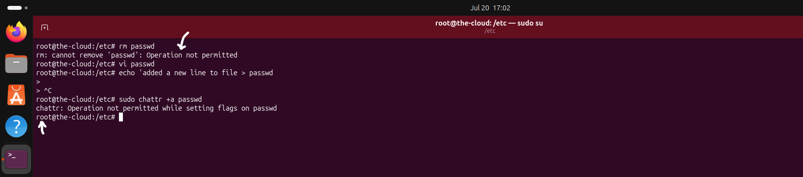

# File Integrity

## Overview

Protecting a Linux server involves more than controlling access and recording system activity. Critical system files and log files must also be protected against unauthorized modification or deletion to preserve system integrity and maintain reliable evidence during security investigations.

Linux provides extended file attributes that allow administrators to apply additional protections beyond traditional file permissions. By making critical files immutable or append-only, organizations can significantly reduce the risk of accidental modification, insider misuse, and attempts by attackers to tamper with important system files.

This chapter demonstrates how file integrity protections were implemented to safeguard critical configuration files and preserve security logs on the Ubuntu server.

## File Integrity Controls Implemented

The following file integrity controls were implemented to protect critical system files and preserve important security logs.

- Protecting critical system files with immutable file attributes.
- Preventing log tampering using append-only file attributes.

# 1. Immutable Files

### Why?

Critical system files are essential to the secure operation of a Linux server. Unauthorized modification or deletion of these files can lead to privilege escalation, service disruption, or loss of important system configurations.

Applying the immutable (`+i`) file attribute provides an additional layer of protection by preventing files from being modified, renamed, or deleted until the attribute is explicitly removed. This strengthens file integrity beyond traditional Linux file permissions.

### Implementation

Linux extended file attributes were used to protect selected critical system files against unauthorized modification.

The immutable (`+i`) attribute was applied to designated files, ensuring they could not be altered, renamed, or deleted, even by privileged users, unless the attribute was intentionally removed.

## Configuration

### Protecting `/etc/passwd` with the Immutable File Attribute

The immutable (`+i`) attribute was applied to the `/etc/passwd` file using the `chattr` utility. The file attributes were then verified to confirm that the protection had been successfully applied, preventing the file from being modified, renamed, or deleted until the immutable attribute is explicitly removed.

## Verification

The immutable file protection was validated by attempting to modify/delete the protected file `(passwd)` as the `root` user after the immutable attribute had been applied.

---

### Test 1 - Attempting to Modify the Protected File

### Verification Result

The modification attempt was rejected because the file had been protected with the immutable attribute.

---

### Security Validation

Successfully preventing modification confirms that the immutable attribute provides an additional layer of protection against accidental changes, insider misuse, and unauthorized tampering with critical system files.

> 💡 **Production Note**
>
> Immutable file attributes are commonly used to protect critical configuration files in production Linux environments. They provide an additional safeguard beyond traditional file permissions and help reduce the risk of unauthorized or accidental modification of sensitive system files.
