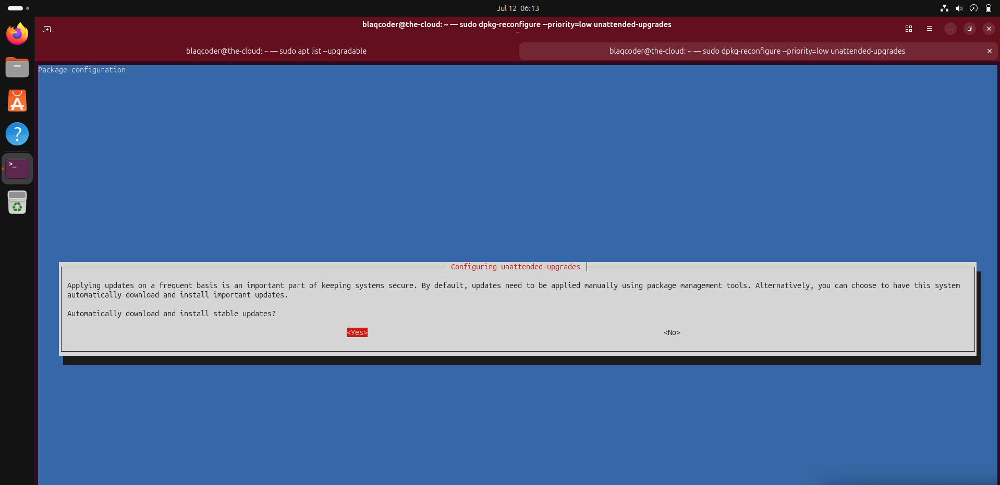
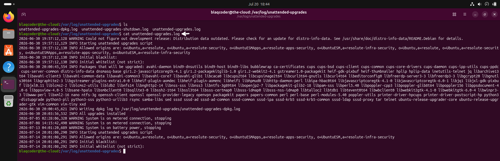

# System Maintenance

## Overview

Securing a Linux server extends beyond implementing authentication, access control, logging, and file integrity protections. Maintaining a secure environment also requires ensuring that the operating system and installed software remain up to date with the latest security patches.

Regular system maintenance reduces exposure to known vulnerabilities, improves system stability, and helps ensure that newly discovered security flaws are addressed in a timely manner. Automating routine maintenance tasks also minimizes the risk of human error and ensures that critical updates are not overlooked.

This chapter demonstrates how automatic security updates and patch management were implemented to maintain the long-term security and reliability of the Ubuntu server.

## System Maintenance Controls Implemented

The following maintenance controls were implemented to improve the long-term security and operational reliability of the Ubuntu server.

- Configuring automatic security updates.
- Applying regular operating system patch management.

# 1. Automatic Security Updates

### Why?

New security vulnerabilities are continuously discovered in operating systems and installed software. Delaying security updates increases the risk that known vulnerabilities may be exploited before administrators have an opportunity to apply available patches.

Configuring automatic security updates helps ensure that critical security fixes are installed promptly, reducing the server's exposure to known vulnerabilities while minimizing the administrative effort required to maintain a secure environment.

## Implementation

Ubuntu's unattended upgrade mechanism was configured to automatically install available security updates without requiring manual administrator intervention.

Automating the update process helps ensure that critical security patches are consistently applied, even when administrators are unavailable to perform routine maintenance tasks.

## Configuration

### Configuring Automatic Security Updates

The unattended upgrades service was configured to automatically install security updates. The configuration was reviewed to confirm that automatic update installation had been successfully enabled.

## Verification

The automatic update configuration was validated by reviewing the unattended upgrades configuration and confirming that the system was configured to install security updates automatically.

---

### Security Validation

The configuration confirmed that future security updates will be installed automatically, reducing the likelihood that critical vulnerabilities remain unpatched due to delayed administrative action.

> 💡 **Production Note**
>
> Automatic security updates are commonly enabled on production Linux servers to reduce the time between vulnerability disclosure and patch deployment. Organizations typically combine automated patching with formal change management processes to balance security, operational stability, and service availability.
