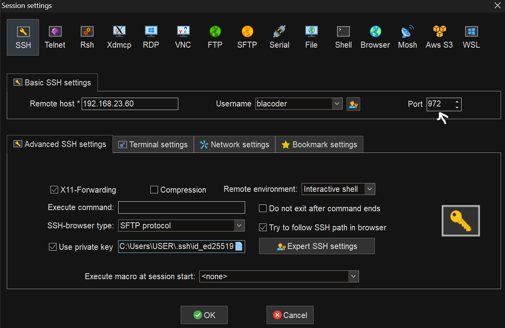
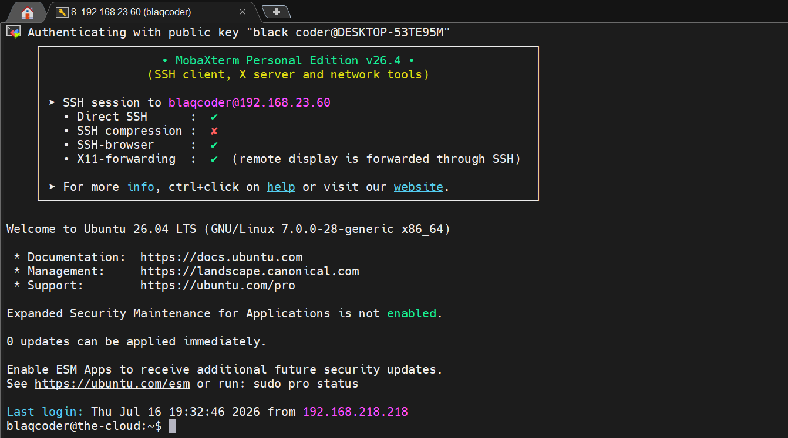
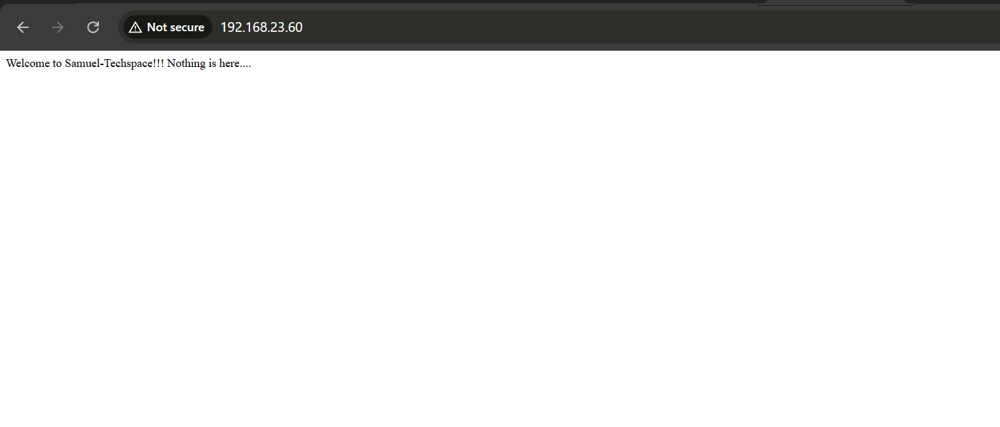

# Network Security

## Overview

Securing a Linux server requires controlling the network traffic that is permitted to enter and leave the system. A properly configured firewall acts as the first line of defense by restricting unnecessary network exposure and ensuring that only authorized services are accessible.

Implementing a default-deny firewall policy significantly reduces the server's attack surface by blocking unsolicited network traffic unless it has been explicitly permitted. Carefully defining inbound and outbound firewall rules also improves operational security while supporting the Principle of Least Privilege at the network layer.

This chapter demonstrates how a host-based firewall was configured to restrict network access, permit only required services, and validate that the implemented firewall rules functioned as intended.

## Network Security Controls Implemented

The following network security controls were implemented to reduce the server's attack surface and restrict network communication to only authorized services.

- Implementing a default-deny firewall policy.
- Allowing only required inbound and outbound network traffic.
- Restricting unnecessary network exposure through explicit firewall rules.
- Validating firewall behavior through controlled connectivity testing.

# 1. Uncomplicated Firewall (UFW)

### Why?

A firewall is one of the most effective security controls for reducing a server's attack surface. By filtering network traffic, it ensures that only explicitly authorized connections are permitted while blocking unnecessary or potentially malicious communication.

Adopting a default-deny firewall policy follows the Principle of Least Privilege at the network layer by allowing only services that are required for normal server operation.

## Implementation

Ubuntu's Uncomplicated Firewall (UFW) was configured to enforce a default-deny firewall policy for both inbound and outbound network traffic.

Only essential services required for server administration and operation were explicitly permitted, including Secure Shell (SSH) on the custom administrative port and HTTP traffic for the hosted NGINX web server.

This configuration minimizes unnecessary network exposure while ensuring legitimate administrative and application traffic remains functional.

## Verification

The firewall configuration was validated by testing connectivity to services that were explicitly permitted and confirming that unauthorized traffic remained blocked by the firewall.

---

### Test 1 - Verifying Allowed Services

### Verification Result

Connections to the SSH service on port `972` and the hosted NGINX web server on TCP port `80` were successfully established, confirming that authorized traffic was correctly permitted.

