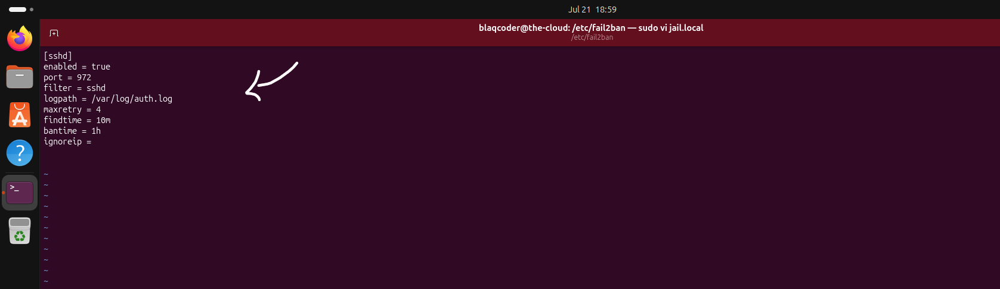
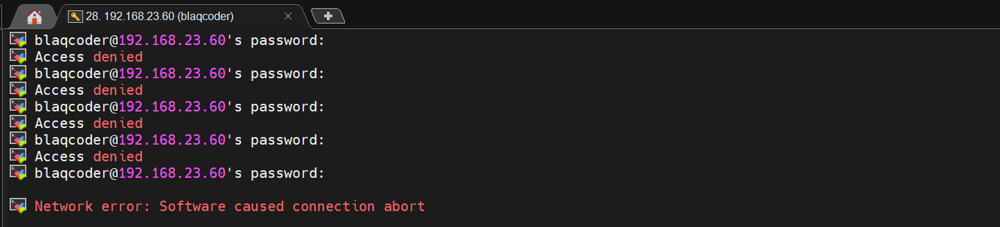
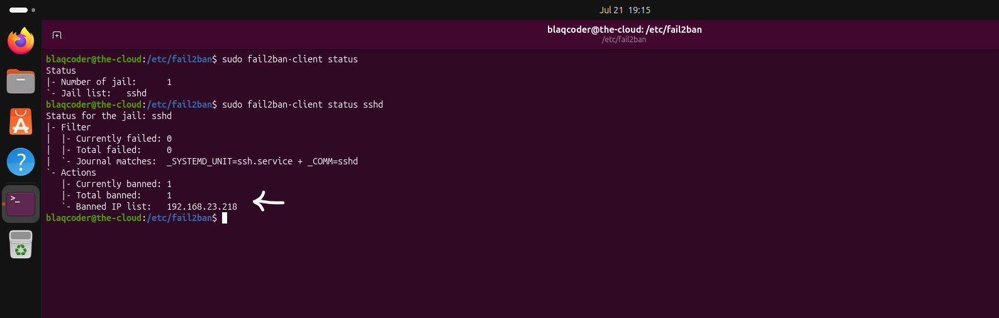
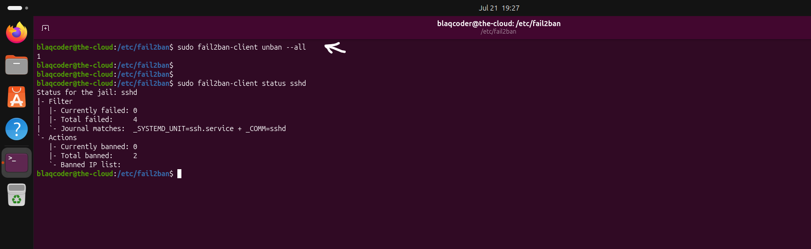
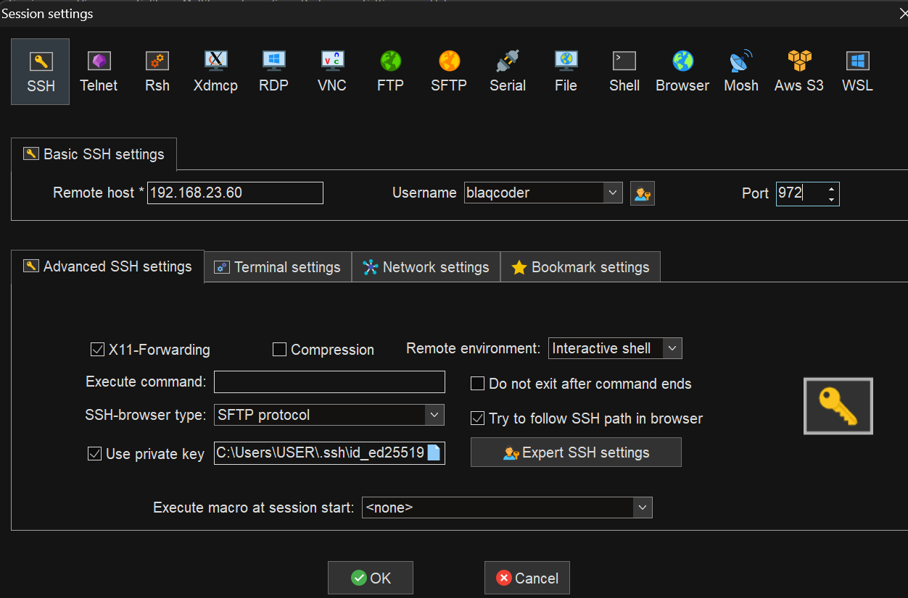
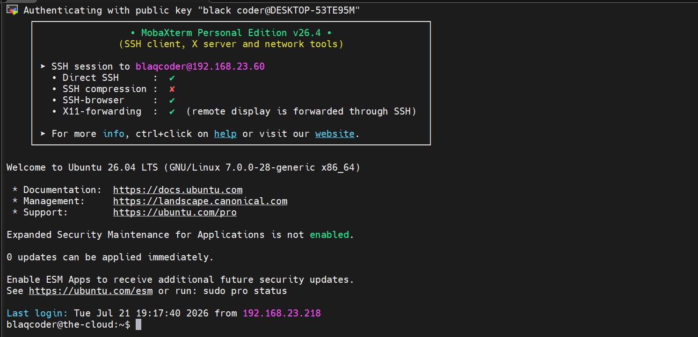

# Intrusion Prevention

## Overview

Preventive security controls such as authentication hardening, access control, and firewalls significantly reduce the likelihood of unauthorized access. However, Internet-facing servers are continuously subjected to automated attacks, including brute-force login attempts and credential guessing.

Intrusion prevention complements these controls by continuously monitoring authentication activity and automatically responding to suspicious behavior before it develops into a successful compromise.

This chapter demonstrates how Fail2Ban was configured to detect repeated SSH authentication failures and automatically block offending IP addresses, providing an additional layer of protection against automated attacks.

## Intrusion Prevention Controls Implemented

The following intrusion prevention controls were implemented to automatically detect and respond to malicious authentication activity.

- Monitoring SSH authentication logs.
- Detecting repeated failed login attempts.
- Automatically banning offending IP addresses.
- Validating automatic recovery after removing the ban.

# 1. Fail2Ban

### Why?

Internet-facing SSH services are frequently targeted by automated bots performing brute-force and password-guessing attacks. Even when strong authentication controls are in place, continuously allowing repeated authentication attempts unnecessarily consumes system resources and increases operational risk.

Fail2Ban strengthens server security by monitoring authentication logs, identifying repeated failed login attempts, and temporarily blocking offending IP addresses before additional attacks can continue.

##  Implementation

Fail2Ban was configured to monitor SSH authentication logs and automatically ban IP addresses that exceeded the configured authentication failure threshold.

The SSH jail was customized to define the maximum number of failed login attempts, ban duration, and monitoring window, providing automated protection against repeated authentication attacks.

## Configuration

### Configuring Fail2Ban for SSH Protection

Fail2Ban was configured to monitor the SSH service (`sshd`) and automatically ban IP addresses that exceeded the configured authentication failure threshold.

The SSH jail configuration was reviewed to confirm that the intrusion prevention policy had been successfully applied.

## Verification

The intrusion prevention policy was validated by intentionally generating multiple failed SSH authentication attempts and confirming that Fail2Ban automatically blocked the offending IP address.

---

### Test 1 - Triggering Automatic Protection

### Test Setup

Multiple failed SSH authentication attempts were intentionally generated from the same client to exceed the configured Fail2Ban threshold.

---

### Verification Result

After the configured failure threshold was exceeded, Fail2Ban automatically banned the client's IP address and prevented additional SSH connection attempts.

### Test 2 - Verifying Recovery After Removing the Ban

### Test Setup

The banned IP address was manually removed from the Fail2Ban ban list to verify that legitimate access could be restored.

---

### Verification Result

The client successfully re-established an SSH connection after the IP address was removed from the ban list, confirming that Fail2Ban enforcement operated as expected.

### Security Validation

The successful validation confirms that Fail2Ban continuously monitors SSH authentication activity, automatically blocks repeated authentication attacks, and restores legitimate access when the offending IP address is removed from the ban list.

Automating this response reduces the effectiveness of brute-force attacks while providing an additional layer of protection for Internet-facing services.

> 💡 **Production Note**
>
> Brute-force attacks against SSH services are among the most common forms of automated Internet scanning. Production environments commonly deploy intrusion prevention tools such as Fail2Ban to automatically detect suspicious authentication activity and temporarily block offending IP addresses before manual intervention is required.
>
> While intrusion prevention significantly reduces automated attack activity, it is most effective when combined with layered security controls such as SSH key authentication, Multi-Factor Authentication (MFA), least privilege access control, and default-deny firewall policies.
